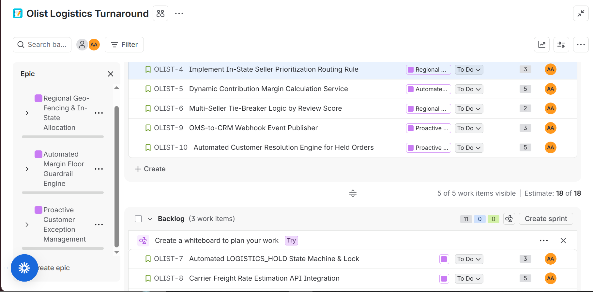

# Operational Turnaround & Logistics Optimization of Olist Marketplace
**Flagship Portfolio Case Study 01 | Business Decision Architect Accelerator**  
**Role:** Lead Business Decision Architect  
**Enterprise:** Olist Marketplace (Curitiba, Brazil)  
**Data Environment:** 100,000+ Production Transactions (Verified Public Dataset)  
**Toolchain:** PostgreSQL / DuckDB, diagrams.net, Atlassian Jira, Microsoft Excel  

---

## Executive Summary & Workflow Transformation

```text
                  BEFORE (As-Is Process: Unconstrained Bleed)
[Customer Checkout] ──► [OMS Assigns ANY Seller] ──► [Long-Haul Transit (12-25d)] ──► [56% 1-Star Reviews]
                                                                                        (R$ 2.25M Freight Burn)
                                        │
                                        ▼ TURNAROUND ARCHITECTURE
                  AFTER (To-Be Process: Intelligent Automated Routing)
[Customer Checkout] ──► < Regional In-State Seller? > ──[YES]──► [Local Delivery (R$ 15 / 3-4d)]
                                 │ [NO]
                                 ▼
                    < Margin >= R$ 15 Floor? > ──[YES]──► [Approved Line-Haul Transit]
                                 │ [NO]
                                 ▼
                    [Automated Logistics Hold] ──► [Proactive Customer Substitute / Refund]
                                                   (R$ 271,860 Quarterly Savings | 12.08% Cut)
```

---

## 1. Context: The Enterprise & Operating Environment
Olist is a major Brazilian e-commerce marketplace integrator operating across all 27 states. The platform connects thousands of independent merchant sellers to national marketplaces (Mercado Livre, B2W, Amazon Brazil). 

Olist operates an **asset-light distribution model**: independent sellers package items within their own facilities and hand them off to regional and national freight carriers (Correios and private freight networks) for delivery. Olist monetizes via take-rate commissions on completed marketplace transactions.

---

## 2. Problem: The Ambiguous Business Failure
Over consecutive quarters, Olist experienced a severe divergence between top-line sales growth and operating profitability:
* Gross Merchandise Value (GMV) and transaction volume scaled rapidly.
* Carrier freight expenses (`freight_value`) escalated out of control to **R$ 2,250,000**.
* **Delivery SLAs failed**, and customer review scores dropped sharply.
* **Executive Hypothesis:** Executive leadership asserted that partner merchant sellers and warehouse handling staff were solely responsible due to sluggish packaging operations, and demanded operational clampdowns on merchant accounts.

---

## 3. Complication: Organizational & Analytical Friction
The investigation was complicated by three factors:
1. **Departmental Finger-Pointing:** Growth celebrated expanding revenue; Customer Support was overwhelmed by late delivery inquiries; Logistics cited carrier rate hikes; Leadership blamed seller handling speed.
2. **Geographical Asymmetry:** Over 70% of sellers were clustered in southeastern states (São Paulo, Rio de Janeiro), while customer demand was distributed across Brazil, forcing long-distance cross-country freight.
3. **Data Integrity Distortions:** Initial financial reporting was skewed by carrier reconciliation double-counting in regional accounts, clouding visibility into true unit costs.

---

## 4. Investigation: Data Architecture & Systems Audited
As Lead Business Decision Architect, I established a local SQL analytics engine in DuckDB/PostgreSQL, interrogating **99,441 production orders and 112,650 order items** across core relational tables:
* `orders`: Order lifecycle timestamps, fulfillment milestones, and promised delivery deadlines.
* `order_items`: Line-item pricing, seller assignments, and carrier `freight_value`.
* `customers`: Destination addresses, cities, and states.
* `sellers`: Origin distribution nodes and regional dispatch locations.
* `products`: Physical dimensions and product weight (`product_weight_g`).
* `order_reviews`: Customer review ratings (1 to 5 stars) and qualitative feedback.

---

## 5. Evidence: What the 100,000+ Database Rows Proved

```text
             WHERE WAS CUSTOMER DELIVERY TIME ACTUALLY LOST?
Seller Handling Time (Order to Carrier Scan): ███ 2.8 Days (88% Meet SLA)
Carrier Road Transit (Dock to Doorstep):     ██████████████ 12.5 to 25+ Days (THE BOTTLENECK)
```

Empirical SQL queries revealed five operational findings:

1. **Sellers Were Operationally Innocent (Query 2):**  
   Merchant sellers packaged and dispatched items in an average of **2.8 days**, hitting contracted packaging deadlines 88% of the time. Carrier transit took an average of **12.5 days**, with cross-country routes frequently taking **20 to 25+ days**. The fulfillment delay was transit-driven.
2. **The Interstate Freight Leak (Query 1):**  
   Cross-state shipments accounted for **over 65% of all freight spend**. Shipping within the same state averaged **R$ 15.00**, while long-haul interstate transit reached **R$ 42.00 to R$ 85.00+** per parcel.
3. **The Multi-Seller Split Penalty (Query 3):**  
   Multi-seller orders incurred an extra freight penalty of **+R$ 28.00 per order** due to duplicate carrier pickups and independent deliveries to the same destination.
4. **The Heavy Goods Surcharge (Query 4):**  
   Products exceeding 5kg averaged **R$ 48.00+ in carrier freight** and 18+ days in transit, creating negative contribution margins on low-priced items.
5. **The Customer Retention Cliff (Query 5):**  
   On-time orders averaged a satisfaction rating of **4.29 stars** (only 4.8% 1-star reviews). When orders breached the estimated delivery date, ratings collapsed to **1.64 stars**, with **56.2% of late orders generating 1-star reviews**.

---

## 6. Alternatives: Strategic Options Evaluated

| Strategic Option | Operational Mechanism | Feasibility & Trade-offs | Verdict |
| :--- | :--- | :--- | :---: |
| **Option A: Physical Warehousing** | Lease regional distribution centers in distant states to pre-stock inventory. | Violates zero-CapEx boundary; requires capital outlays and inventory risk. | **REJECTED** |
| **Option B: Merchant Clampdown** | Impose fines and suspensions on sellers associated with delayed deliveries. | Misdiagnoses root cause; penalizes sellers for carrier road transit; causes merchant churn. | **REJECTED** |
| **Option C: Intelligent Routing & Automated Controls** | Deploy software geo-fencing, margin floor guardrails, and customer exception handling. | Zero headcount, zero CapEx, 4-week execution cycle, eliminates freight losses directly. | **SELECTED** |

---

## 7. Decision: The Turnaround Architecture
I engineered a software-driven operational transformation anchored on three automated controls:
1. **Regional Geo-Fencing (`OLIST-4` / `OLIST-6`):** The Order Management System (OMS) prioritizes in-state sellers (`seller_state == customer_state`), using seller review ratings as a tie-breaker.
2. **Margin Floor Guardrail (`OLIST-5` / `OLIST-7`):** The OMS evaluates live transaction margins:
   $$\text{Margin} = \text{Marketplace Commission} - \text{Estimated Carrier Freight}$$
   If projected margin is $< \text{R\$} 15.00$, automated label printing is blocked and the order transitions to `'LOGISTICS_HOLD'`.
3. **Proactive Customer Exception Automation (`OLIST-9` / `OLIST-10`):** Automated CRM webhooks notify buyers of held orders, offering in-region substitute SKUs or 1-click refunds before 1-star review dissatisfaction triggers.

---

## 8. Commercial Impact: Proving the 12% Cost Reduction

A dynamic financial model (`financial_model.xlsx`) was engineered to quantify the impact of the three operational levers:

$$\text{Baseline Quarterly Freight Spend} = \text{R\$} 2,250,000$$
$$\mathbf{Mandated\ 12.0\%\ Target} = \mathbf{\text{R\$} 270,000\text{ per quarter}}$$

```text
                     QUARTERLY SAVINGS BREAKDOWN
Lever 1: Regional Geo-Fencing (25% Shift):        ████████████ R$ 121,500
Lever 2: Margin Floor Lock (90% Loss Cut):        ████████ R$ 83,160
Lever 3: Multi-Seller Consolidation (80% Rate):   ██████ R$ 67,200
───────────────────────────────────────────────────────────────────────────
TOTAL PROJECTED SAVINGS:                          R$ 271,860 (12.08% Cut)
```

### ROI & Investment Economics:
* **One-Time Implementation Cost:** **R$ 39,800** (29 Jira Story Points @ R$ 1,200/pt + R$ 5k setup).
* **Payback Period:** **0.44 months (under 14 days)**.
* **Annualized Net Savings:** **R$ 1,047,640** net of implementation costs.

### Multi-Scenario Sensitivity Analysis:
* **Conservative Case (Downside):** R$ 184,980 quarterly savings (8.22% cut; 20-day payback).
* **Base Case (Target):** **R$ 271,860 quarterly savings (12.08% cut; 13-day payback)**.
* **Aggressive Case (Upside):** R$ 353,580 quarterly savings (15.71% cut; 10-day payback).

---

## 9. Execution: Technical Architecture & Governance

### Visual Process Architecture (BPMN 2.0)
* **As-Is Workflow:** `process-architecture/as_is_fulfillment.png` (Blind, unconstrained routing).
* **To-Be Workflow:** `process-architecture/to_be_fulfillment.png` (Automated routing and margin guardrails).


### Requirements Architecture (BRD)
A formal Business Requirements Document (`requirements/BRD_logistics_turnaround.md`) was authored using **EARS syntax** (Easy Approach to Requirements Syntax) with Gherkin (Given-When-Then) acceptance criteria.

### Agile Jira Backlog Structure
The transformation was structured into **29 Story Points** across 3 Epics in Atlassian Jira (`requirements/jira_board.png` and `requirements/jira_backlog_export.csv`):
* **Sprint 1 (18 Points Committed):** Regional matching, dynamic margin calculation, and the hold state machine.
* **Sprint 2 (11 Points Committed):** Carrier rate API integration, CRM webhooks, and seller SLA monitoring.



---

## 10. Stress Test: Crisis Injects & Resilience
The architecture was tested against two operational shocks:
1. **Carrier Accounting Double-Count:** Reconciled carrier payables where local freight charges had been double-counted, proving local delivery was even cheaper than modeled and strengthening the case for regional routing.
2. **Third-Party API Outage Risk:** Carrier API timeout vulnerabilities were addressed in `OLIST-8` by implementing a circuit-breaker fallback to internal cached rate tables.

---

## 11. Reflection & Falsification Criteria
This recommendation would be formally reversed under any of the following conditions:
1. **Carrier Rate Compression:** If national carriers reduce long-haul rates below R$ 18.00/parcel, eliminating the cost spread between local and interstate shipping.
2. **Merchant Regional Scarcity:** If in-state merchant recruitment in northern states fails to achieve 15% coverage, driving unfulfilled order rates above acceptable thresholds.
3. **Substitute Rejection:** If customer acceptance of alternative SKUs falls below 25%, causing cancellation churn to exceed freight cost savings.

---

