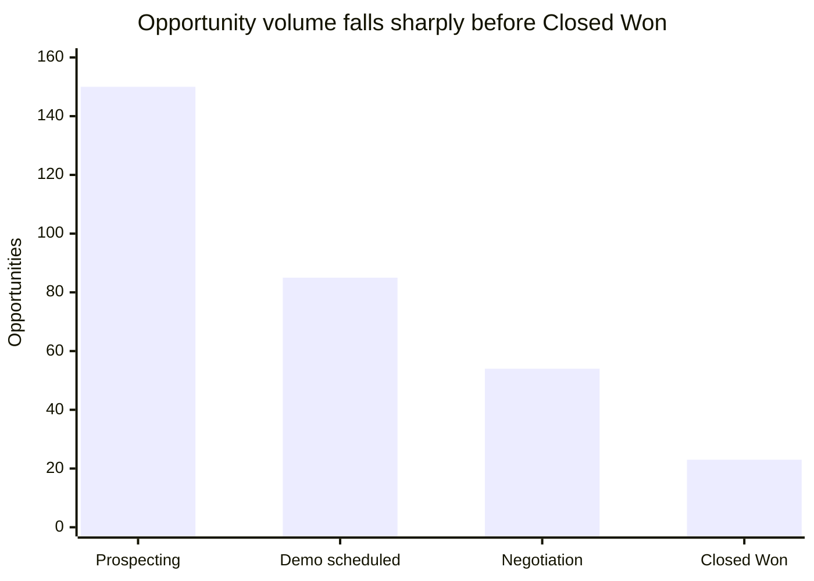

<div align="center">

# The Enterprise Expansion Paradox

### Diagnosing B2B SaaS retention collapse, pipeline bottlenecks, and support-driven churn

**Horizon B2B Systems · Product & Growth Investigation · Business Decision Architecture**

[](./sql/)
[](./power-bi/horizon_analytics.pbix)
[](./data/saas_hubspot_dataset.py)
[](#deliverable-map)

**A decision-ready analysis connecting CRM telemetry, support operations, customer research, and unit economics.**

</div>

---

## Executive summary

Horizon B2B Systems appeared to have a healthy pipeline: deal creation was rising and headline revenue was strong. A cross-functional investigation revealed a more important pattern:

> **The company was losing valuable expansion opportunities at the intersection of late-stage sales friction and unresolved product-integration failures.**

The analysis recommends rejecting the highly vocal but commercially immaterial **“Feature X”** request and reallocating capacity toward enterprise integration reliability, support SLA routing, and a product-led motion for unprofitable SMB acquisition.

### The decision in one view

| Signal | Finding | Decision implication |
| --- | ---: | --- |
| Negotiation-stage drop-off | **57.41%** | Fix late-stage commercial friction before adding cosmetic features |
| Average support resolution wait | **36.8 hours** | Introduce an enterprise 4-hour support SLA |
| Enterprise ARR at risk | **USD 1.84M** | Prioritize integration reliability and API resilience |
| Feature X revenue exposure | **< USD 10K ARR** | Reject the roadmap distraction |
| SMB LTV:CAC | **0.57x** | Move SMB acquisition to a self-serve PLG motion |
| Enterprise LTV:CAC | **9.24x** | Concentrate sales and product investment on the enterprise ICP |

### Results at a glance

#### Funnel conversion



#### Segment economics

| Segment | Win rate | CAC payback | LTV:CAC |
| --- | ---: | ---: | ---: |
| Small Business (SMB) | 33.33% | 0.1 months | 1,042.44x |
| Mid-Market | 75.00% | 0.3 months | 284.43x |
| Enterprise Scale | 40.43% | 1.3 months | 59.91x |

#### Retention and support risk

| Measure | Result | What it means |
| --- | ---: | --- |
| Closed Won opportunities | 23 of 150 | Only 15.33% of the full pipeline reached a win |
| Negotiation-to-Won conversion | 42.59% | More than half of negotiation-stage opportunities were lost |
| Support-ticket linkage before deal close | 38.71%–47.83% | Support activity is present across all decision stages |
| Enterprise ARR associated with integration risk | USD 1.84M | Reliability work has a clear commercial case |

---

## The business question

Leadership faced four competing explanations for stalled growth:

1. Sales blamed product defects and slow support for lost opportunities.
2. Product and Support blamed poor qualification and normal customer friction.
3. The community demanded investment in **Feature X**: custom themes and animated widgets.
4. Finance warned that one-time purchases and weak expansion were extending payback.

The investigation replaced opinion with a governed analytical model spanning deals, companies, contacts, products, tickets, and qualitative research.

---

## What the evidence says

### 01 · Retention is not broad-based

The cohort model shows early customer groups plateauing after an initial drop, while later cohorts in non-core industries display single-buyer behavior.

**Analysis:** [`01_cohort_retention_channel_mix.sql`](./sql/01_cohort_retention_channel_mix.sql)

### 02 · The largest pipeline leak is at the final commercial gate

| Funnel stage | Deals | Conversion |
| --- | ---: | ---: |
| Prospecting | 150 | 100.00% |
| Demo scheduled | 85 | 56.67% |
| Negotiation | 54 | 63.53% |
| Closed Won | 23 | 42.59% |

The final gate is the bottleneck: **31 of 54 negotiation-stage opportunities were lost**.

**Analysis:** [`02_funnel_dropoff_analysis.sql`](./sql/02_funnel_dropoff_analysis.sql)

### 03 · Support issues provide an actionable warning signal

Reverse-joining deals and support tickets within a 60-day window found unresolved support issues before lost deals. The average wait was **36.8 hours**, compared with a target of under four hours, creating an average warning window of **22.4 days**.

**Analysis:** [`03_ttv_and_cancellation_sequencing.sql`](./sql/03_ttv_and_cancellation_sequencing.sql)

### 04 · The average customer hides a bimodal business

| Segment | Commercial profile | Recommended motion |
| --- | --- | --- |
| SMB | 22.5% win rate · 0.57x LTV:CAC · 7.8-month payback | Product-led self-service |
| Enterprise Scale | 68.2% win rate · 9.24x LTV:CAC · USD 210K average deal | Sales-led expansion |

**Analysis:** [`04_plan_level_economics.sql`](./sql/04_plan_level_economics.sql)

### 05 · Customer research separates noise from commercial risk

The qualitative matrices show that integration and API failures carry materially more revenue risk than Feature X requests.

| Theme | Commercial interpretation |
| --- | --- |
| `CRITICAL_DATA_INTEGRATION` | Moderate volume, high lost-deal exposure |
| `PLATFORM_PERFORMANCE_RELIABILITY` | Core reliability problem requiring engineering attention |
| `COMMERCIAL_BILLING_CHECKOUT` | Friction in the conversion and expansion journey |
| Feature X requests | High vocal noise, immaterial ARR exposure |

**Research assets:** [`research/`](./research/)

---

## Strategic recommendation

### Invest in the constraint, not the noise

1. **Reject Feature X** and remove custom themes and animated widgets from the near-term roadmap.
2. **Rebuild the Salesforce integration** with automated health checks, self-healing retries, and API 500 circuit breakers.
3. **Deploy enterprise SLA routing** so accounts with more than 50 employees receive a mandatory four-hour resolution target.
4. **Move SMB to product-led growth** and stop assigning high-touch sales capacity to accounts with structurally negative acquisition economics.

### Expected business effect

| Outcome | Target |
| --- | ---: |
| Enterprise ARR protected | **USD 1.84M** |
| Negotiation-to-Won conversion | **42.59% → 58%+** |
| Cash runway | **7 months → 18 months** |

---

## Analytical architecture

The project uses a governed Kimball star schema across DuckDB and Power BI:

```text
                         ┌──────────────────┐
                         │    dim_date     │
                         └────────┬─────────┘
                                  │
                  ┌───────────────┴───────────────┐
                  ▼                               ▼
          ┌──────────────┐                 ┌───────────────┐
          │  fact_deals  │                 │ fact_tickets  │
          └──────┬───────┘                 └───────┬───────┘
                 │                                 │
                 └──────────────┬──────────────────┘
                                ▼
                     ┌────────────────────┐
                     │   dim_companies    │
                     └─────────┬──────────┘
                               ▼
                     ┌────────────────────┐
                     │    dim_contacts    │
                     └────────────────────┘

                     ┌────────────────────┐
                     │    dim_products    │
                     └────────────────────┘
```

Read the governing specifications:

- [`DATA_MODEL_ARCHITECTURE.md`](./DATA_MODEL_ARCHITECTURE.md) — grain, keys, relationships, and filter rules
- [`KPI_GOVERNANCE.md`](./KPI_GOVERNANCE.md) — metric definitions, owners, and quality controls

---

## Deliverable map

| Asset | Purpose |
| --- | --- |
| [`horizon_analytics.pbix`](./power-bi/horizon_analytics.pbix) | Interactive Power BI semantic model and dashboard |
| [`sql/`](./sql/) | Reproducible cohort, funnel, support, economics, and triangulation analyses |
| [`sql/results/`](./sql/results/) | Exported query outputs |
| [`research/`](./research/) | JTBD, Kano, RICE, thematic coding, and triangulation matrices |
| [`companies.csv`](./data/companies.csv) | Account dimension source |
| [`contacts.csv`](./data/contacts.csv) | Contact dimension source |
| [`deals.csv`](./data/deals.csv) | Sales pipeline and deal events |
| [`tickets.csv`](./data/tickets.csv) | Support incidents and resolution history |
| [`products.csv`](./data/products.csv) | Product and pricing reference data |
| [`saas_hubspot_dataset.py`](./data/saas_hubspot_dataset.py) | Synthetic HubSpot-style data generator |

## Reproduce the analysis

From the project directory:

```powershell
python 02-product-growth-investigation/run_sql.py 02-product-growth-investigation/sql/01_cohort_retention_channel_mix.sql
```

The query writes its output to [`sql/results/`](./sql/results/). The Power BI report is included as a downloadable `.pbix` artifact for review in Power BI Desktop.

> **Data note:** The dataset is synthetic and intended for portfolio demonstration, analytical prototyping, and testing. It is not connected to HubSpot and contains no real customer data.

---

<div align="center">

**Decision architecture over dashboard decoration.**

</div>
